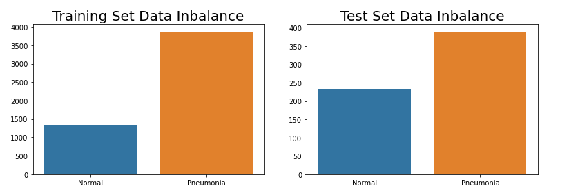
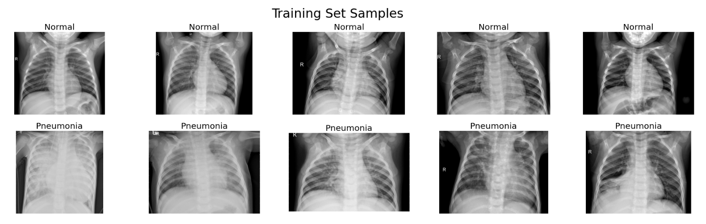
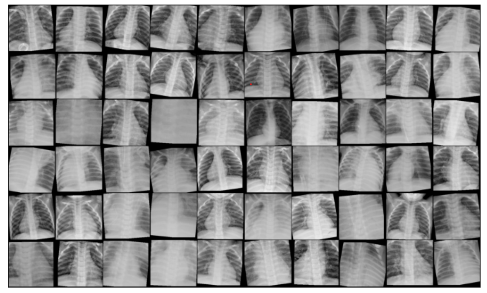
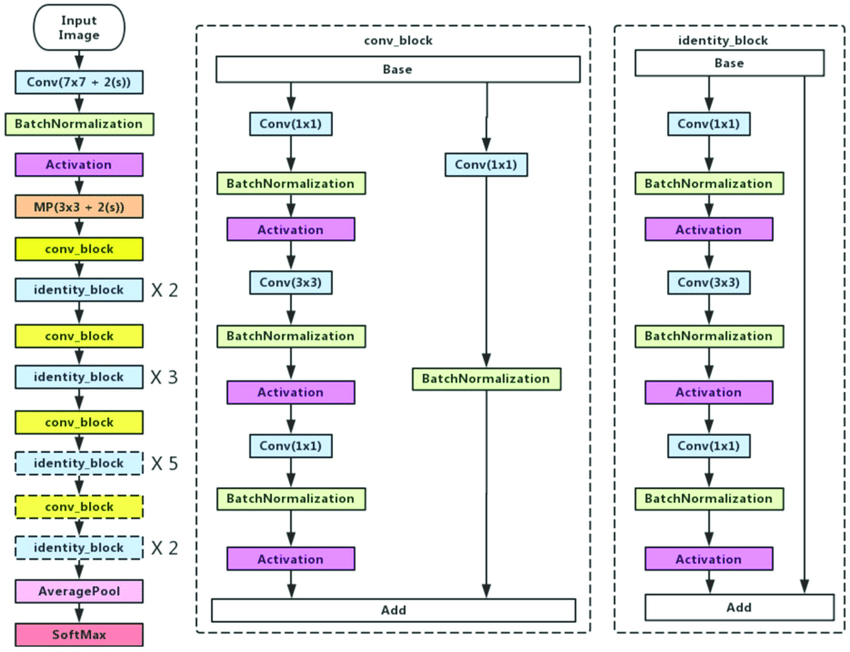
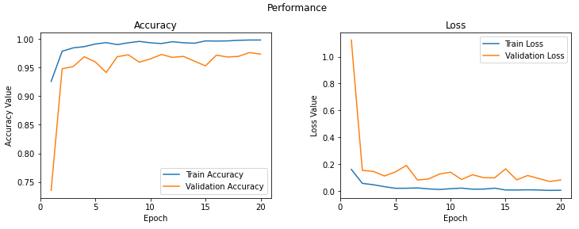
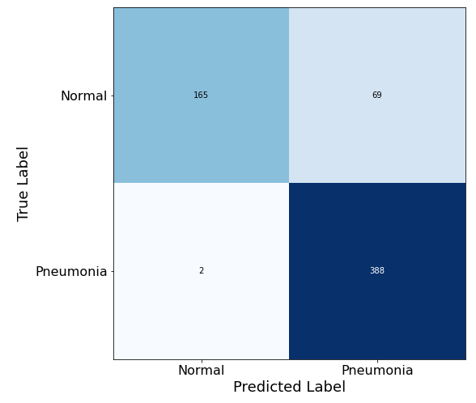
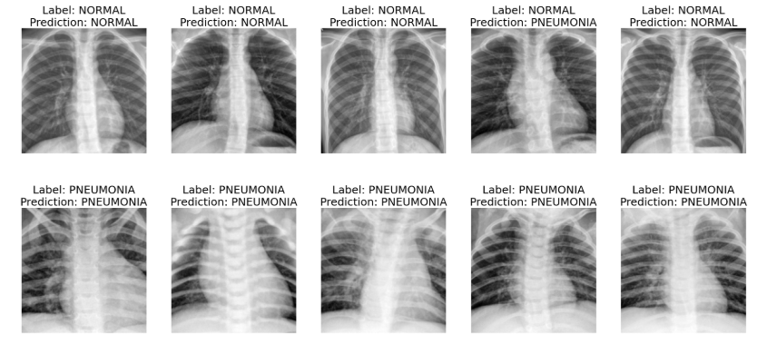

# Pneumonia Detection with ConvNet using Transfer Learning via ResNet50 

Author: TeYang, Lau  
Last Updated: 14 July 2020

### **Please refer to this [notebook](https://www.kaggle.com/teyang/pneumonia-detection-resnets-pytorch?scriptVersionId=38723009) on Kaggle for a more detailed description, analysis and insights of the project.** 

## **Project Motivation** 

For this project, I applied deep learning and convolutional neural networks onto health data, which is my interest and linked to my background and work experience in psychology and neuroscience. Machine learning will become increasingly important to healthcare, and can help in the diagnosis and prediction of many diseases if used correctly. Here, I also used Pytorch as the deep learning framework as I recently took a course on it and wanted to apply it to a more complicated project.

## **Project Goals** 

1. To build a deep learning model to **detect** pneumonia from x-ray scans
2. Use Pytorch as the framework for building the model
3.  Try out different strategies for improving model performance (e.g., learning rate scheduling, gradient clipping)

## **Project Overview** 

* Resizing images to same size tensors using `ImageFolder` and `torch.transform`
* Data augmentation to create diversity using `torch.transform`
* Using `ResNet50` network to pre-train model on Kaggle's GPU
* Tuning hyperparameters of the model such as learning rate, min-batch size etc
* Evaluating training and validation set to achieve the best model performance

## **About this dataset** 

The [chest X-ray images](https://data.mendeley.com/datasets/rscbjbr9sj/2) (anterior-posterior) were selected from retrospective cohorts of pediatric patients of one to five years old from Guangzhou Women and Children’s Medical Center, Guangzhou. All chest X-ray imaging was performed as part of patients’ routine clinical care. For the analysis of chest x-ray images, all chest radiographs were initially screened for quality control by removing all low quality or unreadable scans. The diagnoses for the images were then graded by two expert physicians before being cleared for training the AI system. In order to account for any grading errors, the evaluation set was also checked by a third expert. It consists of ~5,000 train images (split into 70% train and 30% validation), and ~600 test images. There is also a data class imbalance, with more pneumonia compared to normal images.

## Chest X-Ray Samples

Here are some sample pictures of the chest x-ray scans and their associated diagnosis. Notice that some pictures are quite hard to distinguish and normal shallow networks/models might not be able to correctly learn and classify them.

## **Data Augmentation** 

I performed data augmentation by transforming the pictures (random rotation, flipping, random grayscale, and horizontal and vertical shifting) to produce more diversity in the dataset. 

## **Model Architecture** 

I made use of the power of transfer learning to pretrain the model. As these were already pre-trained, we can use the first layers of weights and add a few additional layers to classify the images into 2 categories. For this project, I used the popular and powerful residual network **ResNet50**. It contains 48 convolutional layers, 1 max pool layer, and 1 adaptive average pooling layer (allowing any image input size). The power of ResNets lies in the **residual blocks/skip-connections**, which allows deeper layers to be trained without hurting performance.

From [Ji et al.(2019)](https://www.researchgate.net/publication/331364877_Optimized_Deep_Convolutional_Neural_Networks_for_Identification_of_Macular_Diseases_from_Optical_Coherence_Tomography_Images)

## **Model Training Performance** 

I tuned a few hyperparameters of the model such as the learning rate, mini-batch size and algorithm used. From the plot below, we can see that the training is slightly overfitting.

## **Model Predictions** 

The model achieved an **accuracy of ~89%**. However, since accuracy is not a good metric for class imbalanced data, precision, recall and F1-score should be used instead. The model achieved an almost perfect **recall of 99%**, with only 2 false negatives. **Precision** suffered at **~85%**, probably due to there being less normal images and so the model did not perform that well on them. The harmonic **F1-score is ~92%**. 

Below are samples of the predictions and their true labels. 

## **Difficulties Faced** 

* **Data class imbalance:** This is quite prevalent in the real world and as data scientists, we should all learn to embrace it and find ways to get around this problem. Usually, one way is to simply collect more data for the undersampled class. However, this is not possible for this dataset and especially for healthcare data, which is very difficult to collect and share. In this kernel, I used **weighted loss** to give more weights to the loss of the normal images. This weighting can be tuned as well to achieve the optimal performance. Stratified sampling is also important in this case, but Pytorch does not yet have any built-in functions.
* **Overfitting:** This dataset is prone to overfitting as seen by the train and validation plots. Therefore, I only selected the model weights that achieved the best/lowest validation loss. However, sometimes the best validation loss are achieved in the early epochs, and it performs very badly on the test set, probably due to class imbalance when batching or sampling. For that reason, I have chosen to select the best validation loss only after certain epochs. However, I am not sure if this is a valid method. For future work, I will research more into this problem.

## **Conclusions** 

In conclusion, the model performed reasonably well, as it managed to predict most of the pneumonia images. This is important as in healthcare diagnosis, accurate prediction of diseases saves lives. However, false positives can also increase the cost of unnecessary healthcare and interventions, as more people with no diseases are diagnosed with them. It can also lead to panic and affect people's physical and mental well-being. Better performance can be achieved with better tuning of the model hyperparameters. This is an iterative process, with lots of trial and error.

Here are some other methods that I tried but did not improve or even hurt performance:

- Learning rate scheduling using:
  - [**Step learning rate:**](https://pytorch.org/docs/stable/_modules/torch/optim/lr_scheduler.html#StepLR) decays the learning rate of each parameter group by gamma every step_size epochs.
  - [**One fit cycle:**](https://pytorch.org/docs/stable/_modules/torch/optim/lr_scheduler.html#OneCycleLR) The 1cycle policy anneals the learning rate from an initial learning rate to some maximum learning rate and then from that maximum learning rate to some minimum learning rate much lower than the initial learning rate. This policy was initially described in the paper [Super-Convergence: Very Fast Training of Neural Networks Using Large Learning Rates](https://arxiv.org/abs/1708.07120). Refer to this [post](https://sgugger.github.io/the-1cycle-policy.html) to get a better understanding.
- **Gradient Clipping:** rescale/limit the values of gradients to a small range below a threshold to prevent undesirable changes in parameters due to large gradient values (exploding gradients), which makes the model unstable. Refer to this [post](https://towardsdatascience.com/what-is-gradient-clipping-b8e815cdfb48) for a better understanding.
- **Weight Decay:** a regularization technique which prevents the weights from becoming too large by adding an additional term (a tunable constant, aka weight decay multiplied by the sum of squares of our model parameters/weights) to the loss function. Refer to this [post](https://towardsdatascience.com/this-thing-called-weight-decay-a7cd4bcfccab) for a better understanding. `Loss = MSE(y_hat, y) + wd * sum(w^2)`

